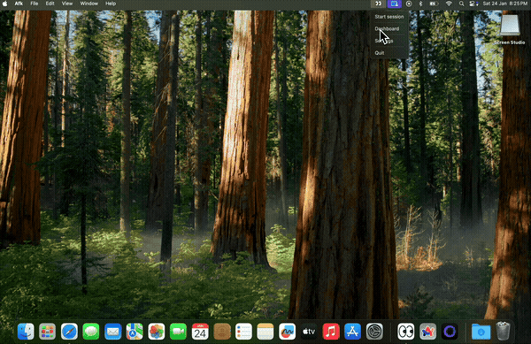

<p align="center">
  
</p>

<h1 align="center">AFK</h1>

<p align="center">
  <strong>A break reminder for developers who forget to blink.</strong>
</p>

<p align="center">
  <a href="https://afk-app.vercel.app">Website</a> •
  <a href="https://github.com/Harry-kp/afk-releases/releases/latest">Download</a> •
  <a href="#install">Install</a>
</p>

---

AFK is a lightweight break reminder that lives in your menu bar. It follows the 20-20-20 rule: every 20 minutes, look at something 20 feet away for 20 seconds. Simple, unobtrusive, effective.

<p align="center">
  
</p>

## Install

**Homebrew (recommended)**

```bash
brew tap Harry-kp/tap
brew install --cask afk
```

**Direct Download**

Download the latest `.dmg` from [releases](https://github.com/Harry-kp/afk-releases/releases/latest).

> First launch: Right-click → Open → Open (required for apps outside the App Store)

## Features

- **Fullscreen break reminders** — Gentle overlays that respect your workflow
- **Configurable timing** — 15-50 min sessions, 20s-5 min breaks
- **Long breaks** — Automatic extended breaks after multiple sessions
- **Menu bar timer** — Always know when your next break is
- **Skip or snooze** — You're in control
- **Launch at login** — Set it and forget it
- **No account required** — Your data stays on your machine

## Why AFK?

Most break reminders are either too aggressive or too easy to ignore. AFK strikes a balance: a fullscreen reminder you can't miss, but with skip/snooze options when you're in flow. No guilt trips, no gamification—just a simple tool that does one thing well.

## Development

```bash
# Prerequisites: Node.js 18+, Rust, Xcode CLI tools (macOS)

git clone https://github.com/Harry-kp/afk.git
cd afk
npm install
npm run dev
```

<details>
<summary>Build for production</summary>

```bash
npm run build
# Output: src-tauri/target/release/bundle/
```
</details>

<details>
<summary>Tech stack</summary>

- **Framework**: Tauri + Rust
- **Frontend**: React, TypeScript, Tailwind CSS
- **Build**: Vite
</details>

## Contributing

Contributions welcome. See [CONTRIBUTING.md](CONTRIBUTING.md).

## License

MIT — see [LICENSE](LICENSE).

---

<p align="center">
  Built by <a href="https://github.com/Harry-kp">Harry</a> • 
  <a href="https://x.com/Harshitc007">Twitter</a>
</p>
